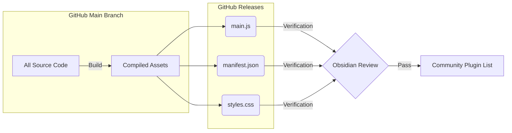

## 📝 Key Trigger (1–3 lines)

> [!NOTE]
> Obisidian Community 기능 및 개요, 플러그인 (plugins) 발행까지 총 정리


## 1. Obsidian Blog - The future of Obsidian plugins

지난 5월 12일, 옵시디언 공식 페이지에 [The future of Obsidin plugins](https://obsidian.md/blog/future-of-plugins/) 라는 글이 올라왔다:


### Obsidian Community 핵심 업데이트 내용

1. **Obsidian Community 사이트 런칭**
    - 플러그인과 테마를 더 쉽게 탐색, 검색, 필터링할 수 있는 공식 웹 디렉토리 오픈.
    - 각 프로젝트별 상세 페이지에서 스크린샷, 보안 스코어카드, 유료 여부 확인 가능.
2. **개발자 대시보드 (GitHub 연동)**
    - 개발자가 직접 플러그인을 제출하고 상태를 추적할 수 있는 통합 대시보드 제공.
    - 기존의 모든 플러그인은 새 사이트로 자동 마이그레이션되었으며, GitHub 계정 연동으로 관리 권한 획득 가능.
3. **자동화된 리뷰 시스템 (Automated Reviews)**
    - 모든 플러그인의 '매 버전'마다 보안 및 코드 품질을 자동 스캔하여 안전성 강화.
    - AI 코딩 도구로 인해 급증하는 제출량에 대응하여 심사 적체를 해소하고 생태계의 신뢰도 향상.


## 2. Obsidian community 5-12 업데이트 둘러보기

2026-5-12 업데이트의 핵심은 크게 세가지다:
- **Community site**: 탐색과 투명성(보안 점수)을 높인 새로운 공식 웹사이트.
- **Developer dashboard**: GitHub 연동을 통한 개발자의 관리 편의성 증대.
- **Automated reviews**: 모든 업데이트 버전에 대한 자동 보안/품질 검사로 안전성 확보.

### 2.1 Community site
먼저 옵시디언 커뮤니티부터 둘러보자.

원래는 [Obsidian Stats라는 사설 커뮤니티 사이트](https://www.obsidianstats.com/)에서 (아래 스크린샷 참조) 플러그인을 검색하거나 일일히 찾아봐야 했었다. 


(비교체험을 위한 obsidian stats 스크린샷. 5-22-2026 기준으로 지금도 살아있다.)

하지만 지금의 커뮤니티 사이트는 **옵시디언 공식** 사이트다. 기존의 Obsidian Stats만큼, 아니, 어쩌면 그보다 더 편리하게 검색할 수 있을 정도로 정리가 잘 되어있고, 무엇보다 밑에서 설명할 **옵시디언 플러그인 개발 및 배포**와도 곧바로 연동이 되어있다


(obsidian community 공식 페이지 스크린샷. 카테고리별 노출과 테마까지 한번에 다 보인다.)

### 2.2 Developer Dashboard

그 다음은 개발자 대시보드다. 커뮤니티 사이트에서 아래 스크린샷 처럼 **우측 상단**을 클릭하면 개발자 대시보드 페이지로 이동된다:


먼저 Community Profile. 옵시디언 플러그인 개발 및 배포를 위해서는 **Github Account** 가 필요하다 (밑에서 후술하겠다):


그 다음 Plugins. 내가 배포하는 플러그인들이 배포되는 공간이다:


다음으로 Themes. 내가 배포하는 '스킨 테마'들이 배포되는 공간이다:


## 3. 잠깐!! 개발자가 되려면 Github 계정부터 만드세요

바이브 코딩을 해보려면 아마 누구나 깃허브 계정 하나쯤은 만들었을 것이다.
그래도 다시 소개하자면.. [일단 주소부터](https://github.com/). 


필자의 깃허브 오버뷰 페이지 예시다.
깃허브 계정이 없다면 일단 계정부터 만들고 새 repository를 만들어보자

## 4. 옵시디언 플러그인 개발을 위한 새 repository 만들기


클릭하면 아래와 같은 화면이 나온다:


크게 세가지만 입력하면 된다:
- **Repository name**: 플러그인 이름 또는 프로젝트 이름으로 해보자 (중복 이름 그런거 신경 안 써도 된다.)
- **Description**: 이게 뭐에다 써먹는 프로젝트인지
- **Visibility**: Public 상태로 냅두자 (public이 아니면 옵시디언 커뮤니티 자동 리뷰를 받을수가 없어요!!)

만들고 나면 이런식으로 페이지가 생긴다 (이미 잔뜩 올려둔 repository의 예시):


## 5. 새 플러그인 페이지를 옵시디언 Community site에 연동하기

다시 [옵시디언 커뮤니티 페이지](https://community.obsidian.md/account/plugins)로 돌아와서 


New plugin을 누르면 아래와 같이 페이지가 생긴다:


`GitHub repository URL`주소에 **내가 새로 만든 Repository** 또는 **이미 내가 옵시디언 플러그인 만들어는 놨는데 깃허브에만 올라간 페이지** 주소를 링크를 첨부하면 된다.


## 6. URL을 첨부했어요! 그래서 이제 뭐 해야되요?

이제부터가 중요하다. 아래의 스크린샷처럼 필자가 개발한 [obsidian-hwp-writer](https://github.com/laguna821/obsidian-hwp-writer) 를 draft로 등록한 상태를 예시로 보자:


**플러그인 배포에서 가장 중요한 공통 규칙 - `Obsidian`  이라는 글자가 들어간 파일이 있으면 안된다.**
- 개발 소스코드 에 `obsidian` 이라는 ID가 플러그인 이름으로 들어가면 안된다.
- 커뮤니티 플러그인 이름 자체도 `obsidian` 이라는 제목을 달 수 없다.
- 플러그인 description에도 `obsidian` 이라는 단어가 코드에 있으면 안된다.

**그러니까 obsidian 이라는 단어가 코드 또는 플러그인 제목 등에 들어가있으면 입구컷이다. 
등록 자체가 안된다.**

다시 위 스크린샷을 기준으로 보면, `Publish` 라는 버튼을 눌러야 등록이 되고, `Delete draft` 를 누르면 아예 통째로 삭제가 된다.

## 7. 오 이제 대충 알거 같아요. 그러면 이제 리뷰 통과 어떻게 해요?

무지성으로 `Publish` 를 누르지 말고, **Review Branch를 통과하느냐**가 핵심이다.
다시 아래 스크린샷을 보자:


우측 상단에 Review Branch라는 버튼이 있는데, 클릭하면 아래와 같이 나온다:


참고로 자동 Review Branch가 통과하면 이런식으로 나와야 한다:


리뷰 횟수는 **무제한**이다. **그러니까 될 때까지 해보면 된다.**


## 8. 리뷰 통과하려면 깃허브에 뭘 올려야되요?

**이제부터가 중요하다.** 
커뮤니티 플러그인 review branch를 통과하려면 크게 보자면 3가지 정도다:
- 깃허브에 "`메인 브랜치`"가 **최신 버전을 디폴트로** 해놓을것  
- 깃허브 `메인 브랜치`에 **나의 모든 개발 소스를 오픈 소스로 누구나 맘껏 가져갈 수 있게** 올려놓을것  
- `Releases` 항목에 별도로 또 업로드 하되, 여기에는 `main.js`, `manifest.json`, `styles.css` 세 가지의 첨부파일만 업데이트 노트와 함께 올릴것  
  
이를 알기 쉽게 도식화하면 다음과 같다:
```
my-obsidian-plugin/ (Main Branch - 전체 소스 공개)
├── src/                # 모든 개발 소스 코드
├── manifest.json       # 플러그인 정보 (필수)
├── main.ts             # (또는 main.js) 소스 파일
├── styles.css          # 스타일 시트 (필요 시)
├── package.json        # 의존성 관리
└── ...

[Releases]              # 배포 항목 (Assets에 3개 파일만 업로드)
└── v1.0.0
    ├── main.js         # 빌드된 자바스크립트
    ├── manifest.json   # 플러그인 정보
    └── styles.css      # 스타일 시트
```




뭔 말인지 감이 잘 안오니까 필자가 배포한 플러그인 깃허브를 예시로 보자:


깃허브 페이지에는 **내가 플러그인을 개발하는데 사용된 모든 소스**를 그대로 업로드 해놓았다.
참고로 깃허브 repository를 처음 만들면 아래와 같이 좌측 상단에 `main` 이라고 되어있다:


`main`을 클릭해서 `view all branches`를 눌러보면


아래 스크린샷 화면처럼 나오는데 `new branch` 를 눌러서 새로 만들 수 있다


### 잠깐잠깐! Branch라는게 뭐에요?

브랜치는 말하자면 **개발자를 위한 게임 세이브칸**이다. 
아래 설명도를 보면 알기 쉽다:


예를 들어 내가 버전이 `1.5.0`은 **기능이 아직 그닥 썩 만족스럽진 않고 우와아아아 이런 느낌은 아니는데 그냥 굴러는 가는 상태**라고 치자. 그런데 내가 기능을 추가해보려다가 **망해버렸는데 1.5.0에 모르고 덮어 씌워버렸네?** 라는 상황이 발생하면 **복구할 방법이 없다 (자체 로그라이크 바이브코딩이라니..).**
그러니까 이런 상황을 방지하기 위해서 `1.5.0`은 그대로 두고, 따로 세이브 칸을 따로 만들어서 거기에서 뭘 지지고 볶든 해보는 것이다.

### 그래서 브랜치가 커뮤니티 플러그인 review랑 뭔 상관이에요?

모든 깃허브 repository는 `settings - default branch` 에서 `main` 을 변경 가능하다:


그러니까 **브랜치를 항상 최신으로 해놔야 한다**는 말은 이렇다:


위 스크린샷을 보면 `main`이 아니라 `3.0.3`으로 바뀌어 있다. 이런식으로 **'최신버전만 있는 세이브 파일 공간'이 default가 되도록** 항상 해놔야 한다는 것이다. 

내가 예전에 작업해놓은 다른 버전 (다른 세이브파일 공간)들도 들어가보면 다 살아있다.  이걸 '가장 최신 버전 기준으로 최신 개발 소스 업로드' 해야된다는 것이다.

그 다음은 `releases` 항목이다.
아래 스크린샷을 참조해서 release 위치를 확인해보자


`Draft a new release` 항목을 클릭하면 새 버전을 업로드 할 수 있다


`Draft a new release` 로 새 버전을 업로드 할 때 체크할 목록은 다음과 같다:
- [ ] 첨부파일 (Attachements)
	- [ ] `main.js`
	- [ ] `manifest.json`
	- [ ] `styles.css`
- [ ] 본문 내용 (영어 English로 패치노트 작성) 
- [ ] 새 release 태그 - 숫자 `1.0.1` 같은 형식으로 작성

## 9. 개발 소스를 1) 최신 branch로 올리고 2) Release에도 한번 더 올렸어요! 그래서 이제 뭐해요?

이제 다음의 세 가지가 전부 준비되었다:

> [!NOTE] RE-CAP: Obsidian Community Plugin 통과 기준 다시 복습
> - 깃허브에 "`메인 브랜치`"가 **최신 버전을 디폴트로** 해놓을것  
> - 깃허브 `메인 브랜치`에 **나의 모든 개발 소스를 오픈 소스로 누구나 맘껏 가져갈 수 있게** 올려놓을것  
> - `Releases` 항목에 별도로 또 업로드 하되, 여기에는 `main.js`, `manifest.json`, `styles.css` 세 가지의 첨부파일만 **영어 업데이트 노트**와 함께 올릴것  

그러면 이제 Community plugin 내 페이지에서 `Review Branch` 를 클릭한다:


**깃허브에서 내 branch를 최신으로 바꿔놓았기 때문에,** 그냥 `Run preview scan` 을 누르면 된다.


그러면 플러그인 dashboard에서 `Pending` 이라고 뜨는 것을 볼 수 있다:


리뷰가 통과하면 다음과 같이 녹색 불로 `Completed` 라고 뜬다:


자동 Review에 통과하지 못하면 다음과 같이 `Failed` 라고 뜬다:


### 자동 Review Branch를 통과하기 위해서 알아야 할 것

Review Branch에서 뜨는 메시지는 크게 다음의 4가지가 있다:
- **Pass:** 문제가 없음 (완벽해요!)
- **Recommendations:** 굳..이 안 고쳐도 되는데 왠만하면 고쳐주세요
- **Warning:** 이건 당장 고치셔야 합니다 (메시지를 통으로 긁어서 **클로드 코드에게 `야 이거 고쳐야 된대`** 라고 시키세요)
- **Error:** 설마 이거 안 고치고 리뷰 내려고요? (**Fix it right now!**)

### 자동 Review branch 통과하기 (될때까지 무한 반복)

**"수정 후 재심"** 을 통과하는 기본적인 흐름은 다음과 같다:
- Warning, Recommendations, Error 세가지 종류의 메시지 중 하나가 뜨는 항목을 통으로 긁어서 메모장에 복사한다
- 클로드 코드 새 채팅창 세션으로 `야 이거 전부 다 고쳐서 git hub에 새 branch를 파서 버전업해서 커밋하기 위한 계획을 세워봐` 라고 한다
- Github에서 새로운 branch를 default로 바꾼다.
- Release 항목에 새 release를 파서 `main.js`, `manifest.json`, `styles.css` 세 가지를 패치노트와 함께 올린다
- `Review Branch`에 다시 리뷰를 받는다

### 10. Review Branch 를 완벽 통과했어요! 이제 내 플러그인 어떻게 등록되요?

아직 한 단계가 남았다. 
Review Branch를 통과한 후 다음 스크린샷을 참조해보자:


다시 정리하자면:
1. '...' 을 누르면
2. 플러그인 발행 처음이면 아마 "Request auto review"? 같은 식의 메뉴가 있다.
3. 그걸 request 하면 된다.
4. 등록이 이미 된 경우는 옵시디언 공식 플러그인으로 된것이다 (이때부터는 'Check for new release'로 바뀐다.)

### Check for new release는 그러면 뭔가요?

내 플러그인을 버그수정 하거나 기능 추가해서 버전업 하면 누르는 것이다. 
그러니까 위에서 말한대로:

> [!NOTE] 내 플러그인 업데이트 할 때마다 이 짓을 또 해야되
> - 클로드 코드로 작업하고 버전업 한거를 새 브랜치 파서 git push 한다
> - 새 브랜치를 default로 바꾼다
> - release에 `main.js`, `manifest.json`, `styles.css` 를 새 버전을 또 올린다
> - Review branch로 사전 검사를 해본다
> - Review branch가 문제가 없으면 마지막으로 Check for new release를 눌러서 발행한다

이 쯤이면 잘 알겠지만, 참고로 이 과정은 새 플러그인을 발행하는 과정도 완전 똑같다.

## 11. 중요 팁1: 내 플러그인 아이콘 및 이름, 색깔, 설명 바꾸기

발행이 다 되면 `Edit Listing`을 눌러보자


앱의 아이콘, 색깔, 설명 및 스크린샷 등을 전부 추가할 수 있다 (영어로 설명을 쓰는 것을 권장)

### 12. 중요 팁2: 내 플러그인이 커뮤니티 플러그인으로 등록되었는지 확인하기

내 플러그인 대쉬보드에서 `View Listing` 을 눌러보자


그러면 아래와 같이 커뮤니티 플러그인 페이지가 나온다 (예시 - [Notepack Codex 발행된 페이지](https://community.obsidian.md/plugins/achmage-notepack-codex))


`Add to Obsidian` 버튼이 누를 수 있게 버튼이 켜져있다면 모든 리뷰가 다 통과해서 자동 등록된 상태다
자동 리뷰 통과는 거의 즉시 반영된다.


참고로 위 스크린샷처럼 옵시디언 앱 안에서 검색이 되도록 뜨는 데에는 최대 24시간이 걸린다고 한다 (보통은 하루 안에 금방 앱 안에서도 검색이 뜬다)

축하합니다! 이제 당신은 옵시디언 플러그인 공식 개발자가 되셨습니다
우수한 플러그인을 이제 마음껏 마음대로 만들어보세요!!